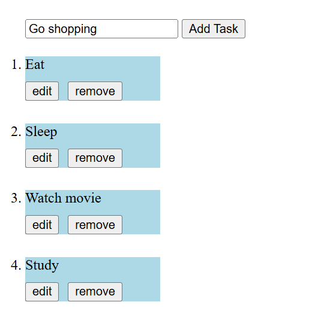
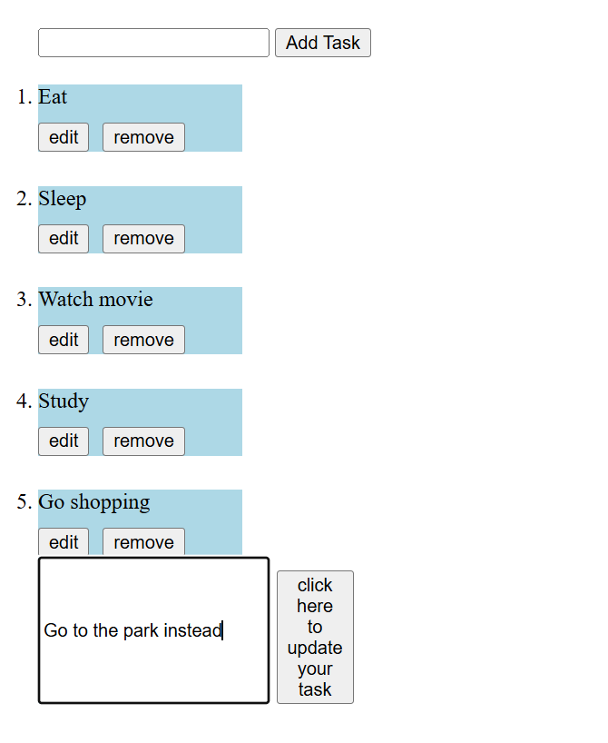

# a2sv-web-track-task-1

# Todo List App

## Description

This Todo List application is a simple yet functional web app built using HTML, CSS, and TypeScript. It allows users to create, edit, and delete tasks, providing an efficient way to manage daily activities.n.

## Features

- Add new tasks to the list
- Edit existing tasks
- Remove tasks from the list

## Instructions for Running the Application

1. **Clone the Repository**: Clone this repository to your local machine using the command:
   ```bash
   git clone https://github.com/ygyesus/a2sv-web-track-task-2.git
   ```

2. **Navigate to the Directory**: Change into the project directory:
   ```bash
   cd a2sv-web-track-task-2
   ```

3. **Install TypeScript**: Make sure you have TypeScript installed. You can install it globally using npm:
   ```bash
   npm install -g typescript
   ```

4. **Compile TypeScript**: Compile the TypeScript file (`todo.ts`) to JavaScript using the following command:
   ```bash
   tsc todo.ts
   ```

5. **Open the HTML File**: Open `index.html` in your web browser to view the application.

6. **Usage**:
   - Type a task in the input field and click the "Add Task" button to add it to the list.
   - Click "edit" next to any task to modify it.
   - Click "remove" to delete a task from the list.

## Project Structure

```
a2sv-web-track-task-1/
├── index.html
├── style.css
└── todo.ts

```

- **index.html**: The main HTML file that contains the structure of the application.
- **style.css**: The CSS file for styling the application.
- **todo.ts**: The TypeScript file that handles the functionality of adding, editing, and removing tasks.

## TypeScript Details

- The interface `Task` is defined to ensure that each task object has a consistent structure with an `id` and `task` property.
- Type assertions (e.g., `as HTMLElement`) are used for better TypeScript type safety when selecting DOM elements.

## Screenshot





